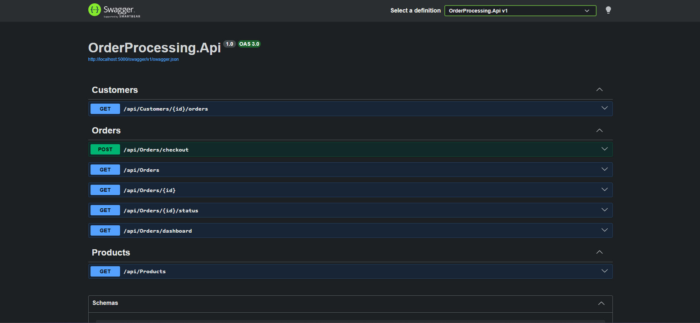
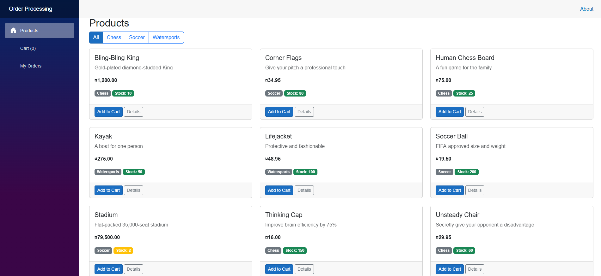
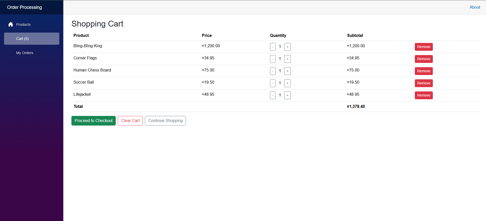
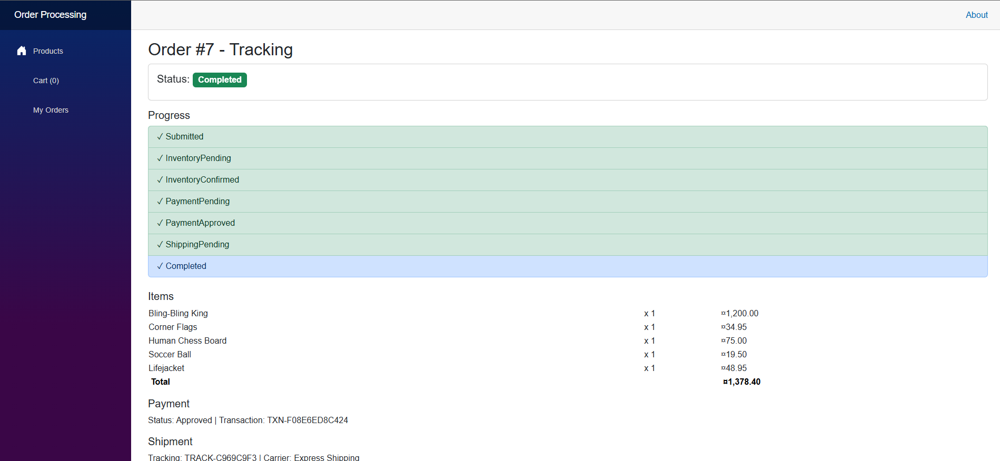
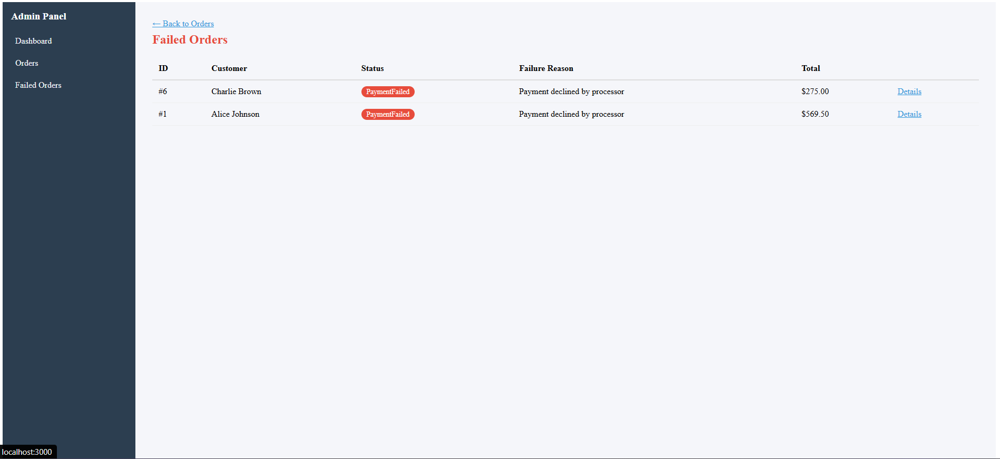
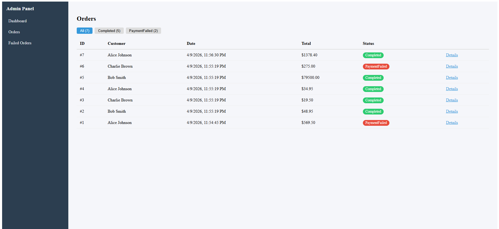
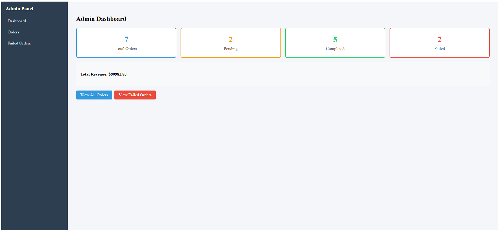
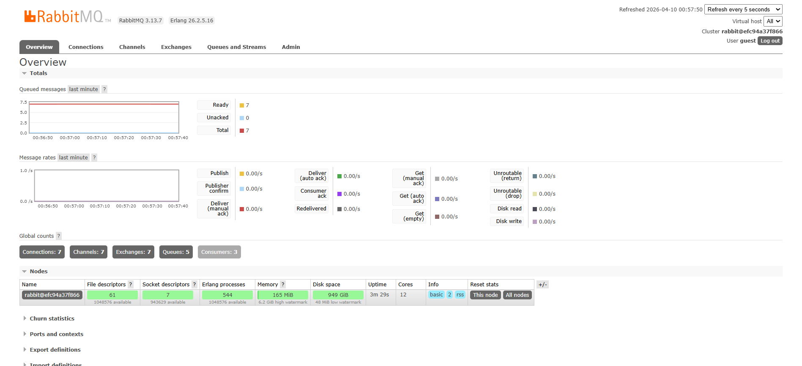
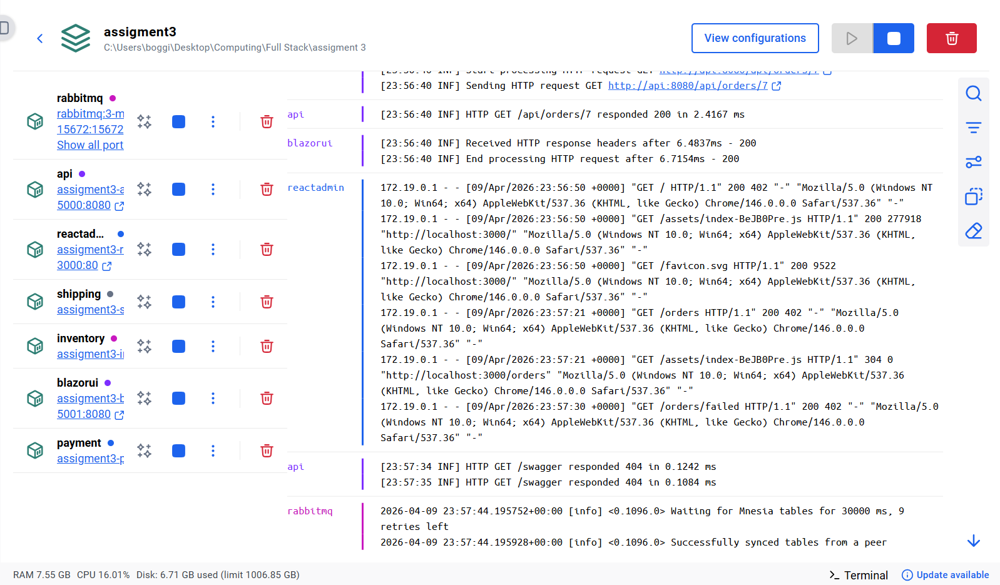

# OrderProcessing - Distributed Order Processing Platform

A distributed order processing system built with .NET 10, using microservice workers that communicate through RabbitMQ. The platform has a Blazor customer portal and a React admin dashboard.

The main idea behind this project is to simulate how a real e-commerce backend would handle orders, where each step (inventory check, payment, shipping) is a separate service that process events independently. This way if one service goes down, the others can keep working and the system stays resilient.

## Architecture

The system follows a **choreography-based saga pattern**, where each worker listens to events and reacts to them without a central coordinator. Every service is independent and communicates only through RabbitMQ queues.

```
                         ┌──────────────┐
                         │   Blazor UI  │ (Customer Portal - port 5001)
                         └──────┬───────┘
                                │
                         ┌──────▼───────┐
    React Admin ────────►│   REST API   │ (port 5000)
    (port 3000)          └──────┬───────┘
                                │ publishes OrderSubmittedEvent
                                ▼
                         ┌──────────────┐
                         │   RabbitMQ   │ (port 5672 / management 15672)
                         └──┬───┬───┬───┘
                            │   │   │
              ┌─────────────┘   │   └─────────────┐
              ▼                 ▼                  ▼
     ┌────────────────┐ ┌──────────────┐ ┌────────────────┐
     │   Inventory    │ │   Payment    │ │   Shipping     │
     │   Worker       │ │   Worker     │ │   Worker       │
     └────────────────┘ └──────────────┘ └────────────────┘
```

### Event Flow

When a customer places an order, this is the full flow:

1. **API** receives the checkout request and publishes `OrderSubmittedEvent`
2. **Inventory Worker** checks if there is enough stock. If yes → `InventoryConfirmedEvent`. If not → `InventoryFailedEvent`
3. **Payment Worker** picks up confirmed orders and simulates a payment (90% success rate). Approved → `PaymentApprovedEvent`. Failed → `PaymentFailedEvent`
4. **Shipping Worker** creates the shipment with a tracking number and marks the order as `Completed`

If any step fails, the order gets marked as `Failed` with the reason, so the admin can see exactly what went wrong.

All events carry a **CorrelationId** that gets passed through the entire chain. This makes it possible to trace a single order across all services in the logs, which is really useful for debugging in distributed systems.

## Tech Stack

| Component | Technology |
|-----------|-----------|
| API | .NET 10, MediatR (CQRS), AutoMapper, Serilog |
| Customer Portal | Blazor Server |
| Admin Dashboard | React 18 + TypeScript + Vite |
| Messaging | RabbitMQ |
| Database | SQLite (shared via Docker volume) |
| Testing | xUnit + Moq |
| CI/CD | GitHub Actions |
| Containers | Docker Compose |

## Project Structure

```
OrderProcessing.slnx
├── OrderProcessing.Shared/        # Entities, DTOs, Events, Enums, RabbitMQ helpers
├── OrderProcessing.Api/           # REST API with CQRS pattern (MediatR)
├── OrderProcessing.Inventory/     # Worker: stock validation consumer
├── OrderProcessing.Payment/       # Worker: payment simulation consumer
├── OrderProcessing.Shipping/      # Worker: shipment creation consumer
├── OrderProcessing.BlazorUI/      # Blazor Server customer portal
├── OrderProcessing.ReactAdmin/    # React + Vite + TypeScript admin dashboard
├── OrderProcessing.Tests/         # xUnit tests (17 tests)
└── docker-compose.yml
```

## Getting Started

### Prerequisites

- [.NET 10 SDK](https://dotnet.microsoft.com/download)
- [Node.js 20+](https://nodejs.org/)
- [Docker](https://www.docker.com/) (for RabbitMQ and full stack deploy)

### Run with Docker Compose (recommended)

This is the easiest way to get everything running. One command and all 7 services start up together.

```bash
docker compose up --build
```

After that you can access:

| Service | URL |
|---------|-----|
| REST API (Swagger) | http://localhost:5000/swagger |
| Blazor Customer Portal | http://localhost:5001 |
| React Admin Dashboard | http://localhost:3000 |
| RabbitMQ Management | http://localhost:15672 (guest/guest) |

### Run Locally (for development)

First start RabbitMQ:

```bash
docker compose up rabbitmq -d
```

Then in separate terminals:

```bash
# API
dotnet run --project OrderProcessing.Api

# Workers (each in its own terminal)
dotnet run --project OrderProcessing.Inventory
dotnet run --project OrderProcessing.Payment
dotnet run --project OrderProcessing.Shipping

# Blazor UI
dotnet run --project OrderProcessing.BlazorUI

# React Admin
cd OrderProcessing.ReactAdmin
npm install
npm run dev
```

When running locally, the API runs on `http://localhost:5145` and Swagger is available at `/swagger`.

## API Endpoints

The API follows CQRS pattern using MediatR. Controllers are thin and just dispatch commands/queries to their handlers.

| Method | Endpoint | Description |
|--------|----------|-------------|
| GET | `/api/products` | Get all products (optional `?category=` filter) |
| GET | `/api/orders` | Get all orders (optional `?status=` filter) |
| GET | `/api/orders/{id}` | Get order details with items, payment and shipment info |
| GET | `/api/orders/{id}/status` | Get just the order status |
| GET | `/api/orders/dashboard` | Dashboard summary (counts, revenue) |
| GET | `/api/customers/{id}/orders` | Get orders for a specific customer |
| POST | `/api/orders/checkout` | Submit a new order |



## Blazor Customer Portal

The customer-facing UI where users can browse products, add them to a cart, checkout and track their orders.

**Pages:**
- **Home** (`/`) - Product catalog with category filtering
- **Product Detail** (`/product/{id}`) - Individual product page
- **Shopping Cart** (`/cart`) - Cart management with quantity controls
- **Checkout** (`/checkout`) - Customer selection and order placement
- **My Orders** (`/my-orders`) - Order history per customer
- **Order Tracking** (`/order/{id}/track`) - Real-time order progress with auto-refresh every 3 seconds

The order tracking page shows a step-by-step progress bar so the customer can see exactly where their order is in the pipeline.







## React Admin Dashboard

The admin panel for monitoring orders and checking system health.

**Pages:**
- **Dashboard** (`/`) - Overview with metrics cards (total orders, pending, completed, failed, revenue)
- **Orders Table** (`/orders`) - Full orders list with status filtering
- **Order Details** (`/orders/{id}`) - Complete order info including payment and shipment data
- **Failed Orders** (`/orders/failed`) - Quick view of failed orders with failure reasons

Both dashboards auto-refresh every 5 seconds so the admin always sees the latest state.







## Testing

The project has 17 xUnit tests covering the main CQRS handlers and AutoMapper configuration.

```bash
dotnet test
```

**Test coverage:**
- `SubmitOrderCommandHandlerTests` - Order creation and event publishing (3 tests)
- `GetOrdersQueryHandlerTests` - Order listing and status filtering (3 tests)
- `GetOrderByIdQueryHandlerTests` - Single order retrieval (2 tests)
- `GetDashboardSummaryQueryHandlerTests` - Dashboard metrics calculation (2 tests)
- `GetProductsQueryHandlerTests` - Product listing and category filter (2 tests)
- `MappingProfileTests` - AutoMapper configuration and entity-to-DTO mappings (5 tests)

Tests use an in-memory SQLite database and Moq for mocking the RabbitMQ publisher.

## CI/CD

GitHub Actions runs on every push and PR to `main`:

1. **Build & Test** - Restores, builds (.NET Release), runs all xUnit tests with coverage report
2. **Build React** - Installs dependencies and builds the React admin dashboard

## Infrastructure

### RabbitMQ

RabbitMQ handles all the communication between services. Each worker subscribes to a specific queue and process messages as they come in.



### Docker

All 7 services run in Docker containers. The database is shared through a volume mount so all workers can access the same SQLite file.



## Design Decisions

- **Choreography over Orchestration**: Each worker reacts to events independently instead of having a central coordinator. This makes the system more decoupled and easier to scale individual services.
- **CQRS with MediatR**: Separating commands from queries keeps the code organized and makes it easier to test each handler in isolation.
- **SQLite**: Chose it for simplicity since this is an academic project. In production you would use PostgreSQL or similar, but SQLite keeps the setup simple and the Docker volume makes it shareable across services.
- **Serilog with CorrelationId**: Having a correlation ID that travels through all the events makes it possible to trace a complete order lifecycle across multiple services, which is essential in distributed systems.
- **90% payment success rate**: The payment worker randomly fails 10% of orders to simulate real-world scenarios and demonstrate the failure handling flow.

## Authors

- Nicolas Boggioni Troncoso
